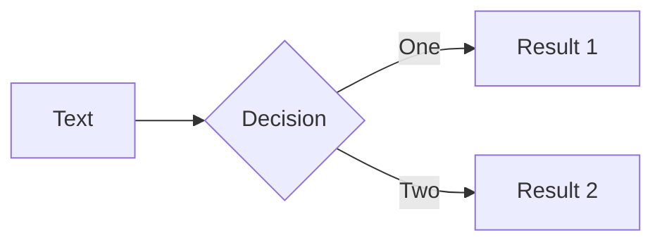

# Front page

With subtitle

---

# Code example

```rust {0|2-4|7|9|9-12|11|0}{lines:true}
/// Adds two numbers.
fn add(a: i32, b: i32) -> i32 {
    a + b
}


#[cfg(test)]
mod tests {
    #[test]
    fn add_adds() {
        assert_eq!(3, add(2,3));
    }
}
```

```ts twoslash
var hoverHere = 123;
```

---

# Math with $\LaTeX$

$$
\sum_i^\infty 2i + \frac{2}{3} = \infty
$$

$$
\begin{align}
    2 + 2 &= 4 \\
    3 + 3 &= 6 \\
    4 + 4 &= 8
\end{align}
$$

---

# Normal text
<br>

Unordered lists.

- Item 1
- Item 2

Ordered lists.

1. Item 3
2. Item 4

---

# Tables

| A | B | C |
|---|---|---|
| 1 | 2 | 3 |
| 4 | 5 | 6 |

---

# Diagrams

With mermaid.


